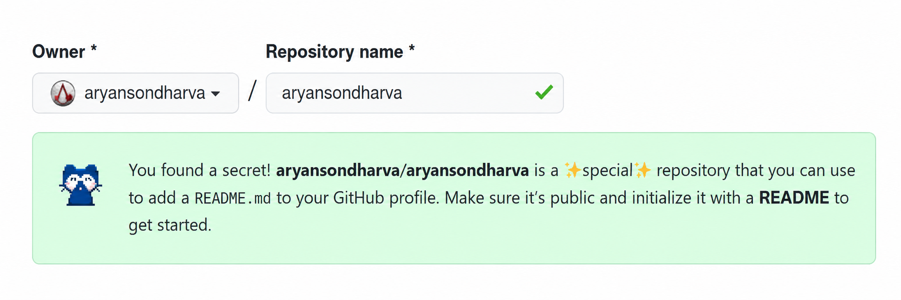
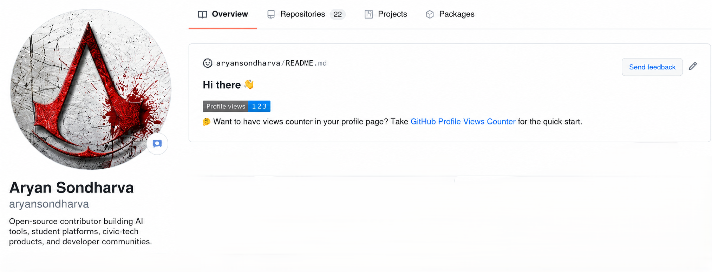

# GitHub Profile Views Counter

## Introduction

GitHub Profile Views Counter is a small JavaScript/Node.js service that counts GitHub profile badge hits and returns an SVG badge.

It can be used to show how many times your GitHub profile has been viewed. The service is designed for profile README badges and works well as a lightweight self-hosted counter.

The counter increments when GitHub loads the badge through GitHub Camo, then displays the current count as a customizable SVG badge.


## Usage

Use the hosted service or deploy it on your own domain, then add the badge URL to your GitHub profile README.

```markdown

```

> [!NOTE]
>
> Replace `your-github-username` with your real GitHub username.

### Create GitHub Profile Repository

GitHub shows a profile README when you create a public repository with the same name as your GitHub username.

For example, if your username is `aryansondharva`, create:

```text
aryansondharva/aryansondharva
```



### Add Counter To GitHub Profile

Add this Markdown to the `README.md` file in your profile repository:

```markdown

```

Example with options:

```markdown

```



## Make It Personal

### Color

You can use any valid HEX color or choose from a predefined named color. `blue` is the default.

| color | demo |
| ----- | ---- |
| `brightgreen` |  |
| `green` |  |
| `yellow` |  |
| `yellowgreen` |  |
| `orange` |  |
| `red` |  |
| `blue` |  |
| `grey` |  |
| `lightgrey` |  |
| `blueviolet` |  |
| `ff69b4` |  |

**Named color**

```markdown

```

**Hex color**

```markdown

```

> [!NOTE]
>
> HEX colors should be used without the `#` symbol.

### Styles

The following styles are available. `flat` is the default.

| style | demo |
| ----- | ---- |
| `flat` |  |
| `flat-square` |  |
| `plastic` |  |
| `for-the-badge` |  |
| `pixel` | Invisible 1x1 SVG pixel counter |

```markdown

```

### Label

You can replace the default `Profile views` label with your own text.


```markdown

```

> [!NOTE]
>
> Replace spaces with `+` in multi-word labels.

### Base Number

You can provide a `base` number to add to the stored counter.

This is useful if you are migrating from another counter service and want to keep your previous count.

```markdown

```

### Abbreviation

Set `abbreviated=true` to show a short count.

For example, `12345` will be displayed as `12.3K`.


```markdown

```

## Supported Parameters

| parameter | default | example | description |
| --------- | ------- | ------- | ----------- |
| `username` | required | `aryansondharva` | GitHub username to count views for |
| `color` | `blue` | `green`, `dc143c` | Badge message color |
| `style` | `flat` | `flat-square` | Badge style |
| `label` | `Profile views` | `PROFILE+VIEWS` | Custom badge label |
| `base` | `0` | `1000` | Number added to the stored count |
| `abbreviated` | `false` | `true` | Shows values like `12.3K` |

Boolean values for `abbreviated` can be `1`, `true`, `yes`, or `on`.

## Local Development

Install dependencies and start the service:

```bash
npm install
cp .env.example .env
npm run dev
```

The app runs at:

```text
http://localhost:3002
```

Local badge example:

```text
http://localhost:3002/ghpvc/?username=aryansondharva&color=green&style=flat-square
```

Run tests:

```bash
npm test
```

## Configuration

The service reads configuration from `.env`.

| variable | default | description |
| -------- | ------- | ----------- |
| `PROJECT_NAME` | `ghpvc` | Docker container name prefix |
| `PORT` | `3002` | HTTP server port |
| `REPOSITORY` | `file` | Storage driver: `file`, `pdo`, or `postgres` |
| `FILE_STORAGE_PATH` | `storage/` | Path for file-based counter storage |
| `DB_HOST` | `localhost` | PostgreSQL host |
| `DB_PORT` | `5432` | PostgreSQL port |
| `DB_USER` | `postgres` | PostgreSQL user |
| `DB_PASSWORD` | `postgres` | PostgreSQL password |
| `DB_NAME` | `github_profile_views_counter` | PostgreSQL database |
| `DB_TABLE` | `github_profile_views` | PostgreSQL table |

## Storage

### File Storage

File storage is the default option. Counts are stored in the `storage/` directory.

```env
REPOSITORY=file
FILE_STORAGE_PATH=
```

### PostgreSQL Storage

PostgreSQL is available through `REPOSITORY=pdo` or `REPOSITORY=postgres`.

Expected table:

```sql
CREATE TABLE github_profile_views (
  username VARCHAR(39) NOT NULL,
  created_at TIMESTAMP NOT NULL DEFAULT NOW()
);
```

## Docker

Start the service with Docker Compose:

```bash
cp .env.example .env
docker-compose up --build
```

The container exposes the service at:

```text
http://localhost:3002
```

## FAQ

### Why does the counter increase on GitHub but not always locally?

The service increments views when the badge request comes from GitHub Camo. Direct browser requests can render the SVG badge, but they are not counted as GitHub profile views.

### Can I use this for any GitHub username?

Yes. Pass the username through the `username` query parameter.

### Can I reset the counter?

Yes. With file storage, remove the matching files from the configured storage directory. With PostgreSQL, delete rows for the username from the counter table.

### Can I hide the visible badge?

Yes. Use `style=pixel` to return an invisible 1x1 SVG pixel.

### Can counters be faked?

Any public badge counter can be manipulated if someone repeatedly requests it through the counted path. Use it as a lightweight profile signal, not as private analytics.

## License

`GitHub Profile Views Counter` is open-sourced software licensed under the [MIT license](LICENSE) by [Aryan Sondharva].

## Stargazers Over Time

[](https://starchart.cc/aryansondharva/GitHub-Profile-Views)

[Aryan Sondharva]: https://github.com/aryansondharva
